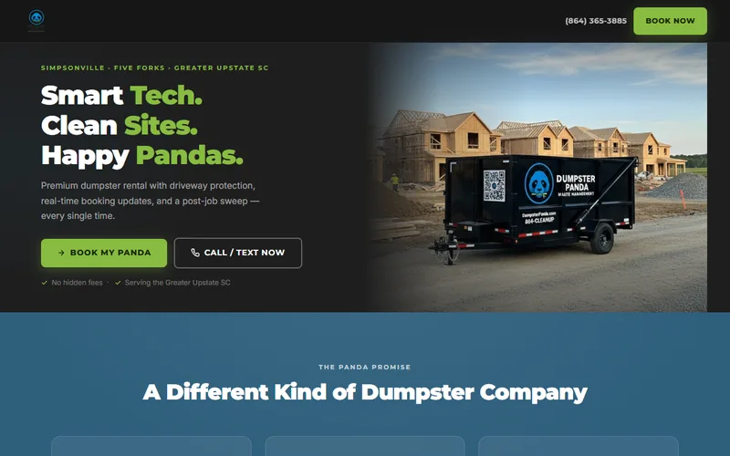

# johnsuchjr.com

Personal brand site for **John Such Jr.** — futurist, marketer, builder.

## Live site

- **Homepage:** https://johnsuchjr.com
- **Repository:** https://github.com/ccherosc/johnsuchjr

## What this repo contains

- A fast static personal website
- Resume and career highlights
- Featured project showcase with outbound links
- Family/life section that humanizes the brand
- FAQ section for positioning, voice, and thought leadership

## Screenshots

### Featured project preview — Show Me Results Only


### Featured project preview — Panda Dumpsters



## Featured project links

- [Show Me Results Only](https://www.showmeresultsonly.com)
- [Panda Dumpsters](https://www.pandadumpsters.com)
- [Market Matters Online](https://www.marketmattersonline.com)
- [Golden Strip Unite](https://www.goldenstripunite.com)
- [Art's Dominos](https://ccherosc.github.io/ArtsDominos-v2/)
- [Uberia Side Scroller](https://ccherosc.github.io/uberia-sidescroller/)
- [Angln](https://www.angln.com)
- [PixelAnt](https://pixelant.netlify.app)
- [Skywriter](https://skywriter.netlify.app)
- [Dungeonsweeper](https://dsweep.netlify.app)
- [Buzzard Roost Daily Cast](https://buzzard-roost-daily-cast-v2.pages.dev/)

## Local development

```bash
npm install
npm start
```

Then open `http://localhost:3000`.

## Quality check

```bash
npm test
```

This verifies:

- core site files exist
- required homepage sections are present
- featured project links are still wired correctly
- local asset references resolve
- internal planning artifacts stay out of the public root
- README includes the live URL

## Repo structure

- `index.html` — homepage
- `resume.html` — browser-friendly resume page
- `assets/` — downloadable PDFs
- `images/` — site images and project preview assets
- `scripts/check-site.mjs` — lightweight repo/site validation
- `.github/internal/` — private planning/generation docs moved out of the public root

## Notes

This repo intentionally stays simple:

- no framework build step
- no fake test script
- no unnecessary package dependencies
- no internal planning docs cluttering the public root
